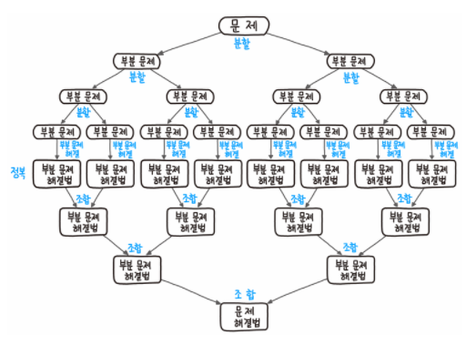

# Divide and Conquer
- 주어진 문제를 둘 이상의 부분 문제(subproblem)로 나누어 각 문제에 대한 답을 구해서 최종 답을 구하는 방식
- 폰 노이맘ㄴ이 병합 정렬을 통해 분할 정복을 설명하였고 대표적으로 퀵 정렬, 합병 정렬, 이진 탐색, 선택 문제, 고속 푸리에 변환(FFT)등이 있다.
<br>  <br>

- 아래 3가지 단계가 존재한다.
    1. Divide(분할) : 원래 문제를 분할하여 비슷한 유형의 더 작은 부분 문제로 분할하는 단계 
    2. Conquer(정복) : 탈출 조건을 설정하고 각 하위 문제를 재귀적으로 해결하는 단계
    3. Combine(조합) : 위 단계에서 해결된 문제를 합쳐서 원래 문제의 답을 얻는 단계

## 적용방식
```
function F(x):
  if F(x)가 간단 then:
    return F(x)를 계산한 값
  else:
    x 를 x1, x2로 분할
    F(x1)과 F(x2)를 호출
    return F(x1), F(x2)로 F(x)를 구한 값
```

## 장점
- 큰 문제를 나눔으로써 어려운 문제를 해결할 수 있다.
- 병렬적으로 문제를 해결하는 데 큰 강점이 있다.
- Top-Down 방식으로 구현하기 때문에 직관적이다.

## 단점
- 함수를 재귀적으로 호출한다는 점에서 함수 호출로 인한 오버헤드가 발생하기 쉽다.(과도한 메모리 사용)
- 함수의 난이도에 따라 알고리즘의 수행능력이 많이 차이난다.

## 특징
- 분할된 작은 문제는 원래 문제와 성격이 동일해야한다.
- 분할된 문제는 서로 독립적이다. (순환적 분할 및 결과 결합 가능)