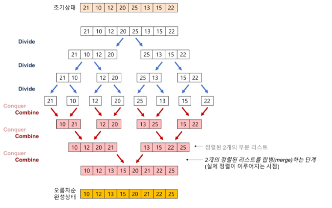

# 정렬
- n개의 숫자가 입력으로 주어졌을 때, 이를 사용자가 지정한 기준에 맞게 정렬하여 출력하는 알고리즘
- 다양한 방법이 존재하고 수행시간도 천차만별(O(N^2), O(NlgN)....)

## 버블 정렬(Bubble Sort)
- 가장 쉬운 정렬 알고리즘이지만 시간복잡도가 좋지 않은 알고리즘
- 버블 정렬은 바로 옆의 원소와 비교하여 정렬

    1. 0번째 원소와 1번째 원소를 비교 후 정렬
    2. 1번째 원소와 2번째 원소를 비교 후 정렬
    ...
    n. n-1번째 원소와 n번째 원소를 비교후 정렬

- 시간 복잡도 O(N^2), 공간 복잡도 O(N)
- 거의 모든 상황에서 최악의 성능을 보이지만 이미 정렬된 자료에서는 1번만 순회하면 되기 때문에 최선의 성능을 보인다.

## 선택 정렬(Selection Sort)
- 주어진 자료들 중에 현재 위치에 맞는 자료를 찾아 선택하여 위치를 교환하는 정렬 알고리즘
- 가장 작은 값부터 앞으로 보내며 정렬하는 방식
    1. 0번 인덱스 ~ n번 인덱스 중 가장 작은 값을 찾아 0번째 인덱스와 교환
    2. 1번 인덱스 ~ n번 인덱스 중 가장 작은 값을 찾아 1번째 인덱스와 교환
    ...
    n. n-1번 인덱스 ~ n번 인덱스 중 가장 작은 값을 찾아 n-1번째 인덱스와 교환
- 시간 복잡도 O(N^2)
- 버블 정렬과 같은 시간 복잡도를 가졌지만  실제로 조금 더 빠른 방식. 하지만 오래걸리는건 매한가지

## 삽입 정렬(Insertion Sort)
- 자료 배열의 모든 요소를 앞에서부터 차례대로 이미 정렬된 배열 부분과 비교하여, 자신의 위치를 찾아 삽입함으로써 정렬을 완성하는 알고리즘
- 매 순서마다 해당 원소를 삽입할 수 있는 위치를 찾아 넣음. key로 지정된 자료와 그 이전 자료들을 비교하는 형식
    1. 2번째 자료가 key가 되어 1번째 자료와 비교 후 정렬
    2. 3번째 자료가 key가 되어 1,2번째 자료와 비교 후 정렬
    3. 4번째 자료가 key가 되어 1,2,3번째 자료와 비교 후 정렬
    ...
- 시간 복잡도 : Best Case O(n) Worst Case O(N^2)
- 알고리즘 자체는 간단하여 복잡한 정렬법 보단 유리할 수 있지만 비교적 많은 레코드 이동을 포함하기에 레코드 수가 많거나 크기가 클 경우 적합하지 않다.

## 합병 정렬(Merge Sort)
- 안정 정렬에 속함
- 분할 정복 알고리즘중 하나로 하나의 리스트를 두 개의 균등한 크기로 분할하고 분할된 부분 리스트를 정렬한 다음 두 개의 정렬된 부분 리스트를 합하여 전체가 정렬된 리스트가 되게 하는 방법
- 다음과 같은 단계를 거침
    1. 분할(Divide) : 입력 배열을 같은 크기의 2개의 부분 배열로 분할한다.
    2. 정복(Conquer) : 부분 배열을 정렬한다. 부분 배열의 크기가 충분히 작지 않으면 순환 호출을 이용하여 다시 분할 정복 방법을 적용한다.
    3. 결합(Combine) : 정렬된 부분 배열들을 하나의 배열에 합병한다.
- 각 부분 배열을 정렬할 때도 합병 정렬을 순환적으로 호출하여 적용하는 것이 특징
- 실제로 정렬이 이루어지는 시점은 2개의 리스트를 합병하는 단계에서 이루어 진다.
    
- 시간 복잡도 : O(nlogn)
- 안정된 정렬 방법으로 정렬 되는 시간이 동일하고 linked list로 구성할 경우 링크 인덱스만 변경되므로 데이터의 이동은 무시할 수 있을 정도로 작아진다.(퀵 보다 빨라짐)
- 하지만 배열로 구성하게 된다면 임시 배열이 필요하기 때문에 레코드들의 크기가 큰 경우에는 이동 횟수가 많아져 큰 시간적 낭비를 초래한다.

## 퀵 정렬(Quick Sort)
- 찰스 앤터니 리처드 호어(Charles Antony Richard Hoare)가 개발한 정렬 알고리즘
- 불안정 정렬에 속하며 다른 원소와의 비교만으로 정렬을 수행하는 비교 정렬에 속함
- 합병 정렬과 마찬가지로 분할 정복 알고리즘
- 하나의 리스트에서 피벗(pivot)을 선정하고 이를 기준으로 두개의 비균등한 크기로 분할하여 분할된 부분 리스트를 정렬한 다음, 두 개의 정렬된 부분 리스트를 합하여 전체가 정렬된 리스트가 되게 하는 방법
    1. 분할(Divide) : 입력 배열을 피벗을 기준으로 비균등하게 2개의 부분 배열(피벗을 중심으로 왼쪽은 피벗보다 작은 요소들, 오른쪽은 피벗보다 큰 요소들)로 분할한다.
    2. 정복(Conquer) : 부분 배열을 정렬한다. 부분 배열의 크기가 충분히 작지 않으면 순환 호출로 다시 분할 정복을 적용한다.
    3. 결합(Combine) : 정렬된 부분 배열들을 하나의 배열에 합병한다.
  
- 시간 복잡도 : best case O(nlogn) worst case O(n^2)
- best의 경우 속도가 가장 빠른 장점을 가진다. 추가 메모리 공간도 필요하지 않다.
- 하지만 정렬된 리스트에 대해서는 수행시간이 더 많이 걸린다는 단점을 가진다. 이는 신중하게 피벗을 선택함으로 어느정도 해결할 수는 있다.

## 알고리즘별 시간 복잡도 정리
  